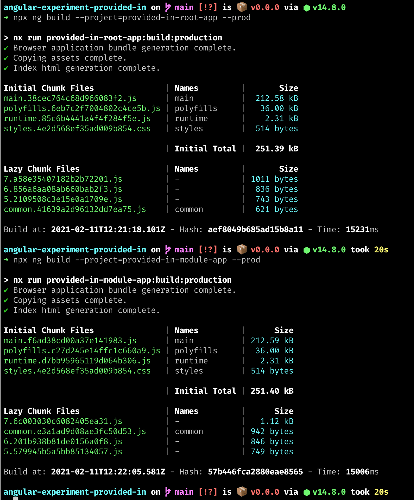

# Angular Experiment ProvidedIn

## Context

This repository contains an experiment meant to gain some insights in the way services that are provided in a module and services injected with `providedIn: root` are
treated in bundling.

Given a service that only needs one instance in the app and is only used in 2 out of 3 lazy loaded routes. How will the bundles look like?

Theoretically it is possible to make a separate js bundle containing that service which could be lazy loaded in the specific routes. 
Does this happen? Does _providing in root_ make a difference over providing the service in a module that's imported only or will they still be bundled together?

## The setup

The repository contains 2 applications. Both applications have a similar setup with 3 lazy loaded routes (module A, B, C). Those routes will import specific services (from modules 1, 2, 3). 
For one application `providedIn: root` services will be used. The other application will import the modules providing the services in the routes.

In this setup one might expect that `Service3` (and `Module3` in case of the _provided in module_ example) are bundled in a separate bundle for _module C_ or bundled together with _module C_.

[](https://mermaid-js.github.io/mermaid-live-editor/#/edit/eyJjb2RlIjoiZ3JhcGggTFI7XG4gICAgQVtBcHBsaWNhdGlvbl0tLT5CW0xhenkgbG9hZGVkIG1vZHVsZSBBXTtcbiAgICBBW0FwcGxpY2F0aW9uXS0tPkNbTGF6eSBsb2FkZWQgbW9kdWxlIEJdO1xuICAgIEFbQXBwbGljYXRpb25dLS0-RFtMYXp5IGxvYWRlZCBtb2R1bGUgQ107XG4gICAgQi0tPkVbU2VydmljZTEgaW4gbW9kdWxlIDFdO1xuICAgIEMtLT5FW1NlcnZpY2UxIGluIG1vZHVsZSAxXTtcbiAgICBDLS0-RltTZXJ2aWNlMiBpbiBtb2R1bGUgMl07XG4gICAgRC0tPkZbU2VydmljZTIgaW4gbW9kdWxlIDJdO1xuICAgIEQtLT5HW1NlcnZpY2UzIGluIG1vZHVsZSAzIF1cbiIsIm1lcm1haWQiOnsidGhlbWUiOiJkZWZhdWx0In0sInVwZGF0ZUVkaXRvciI6ZmFsc2V9)

## The results

It looks like regardless of the places a services is used and they way the service is provided, all services/modules end up in the `common.js`.

The bundle size of `common.js` for the application where services are provided in the module is significantly bigger. This might be explained by the fact that the `ngModule` information for the providing module
is also bundled into this file, resulting in larger file size.
